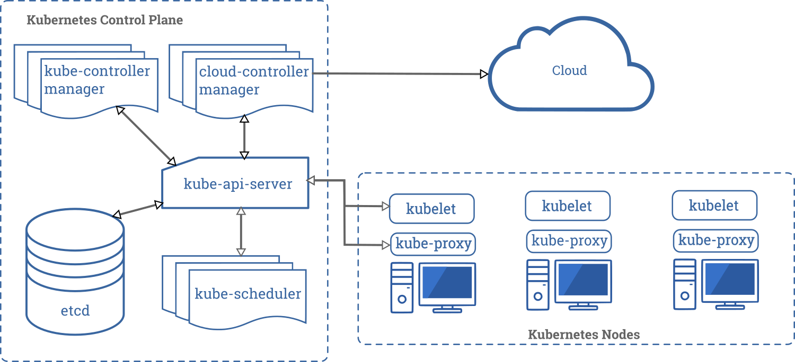
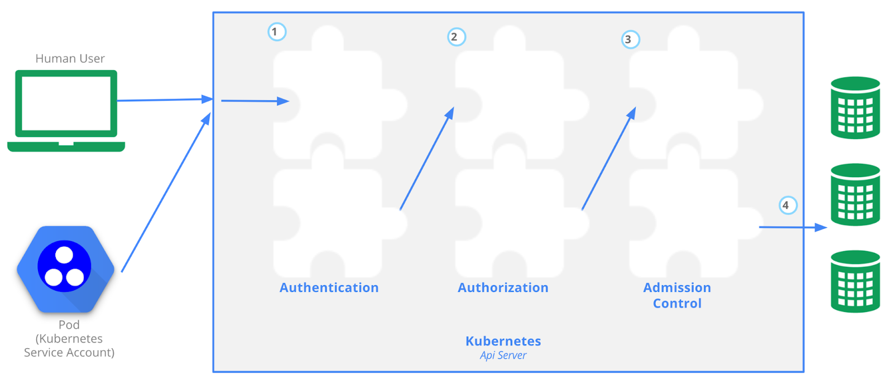
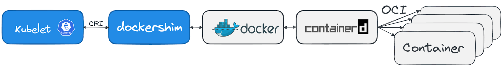
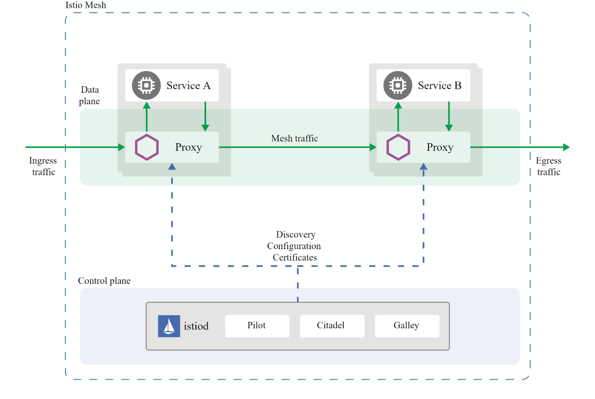
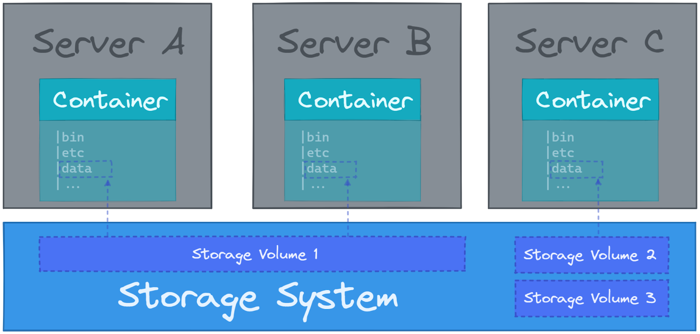

# Abbreviations

+ CNCF: Cloud Native Computing Foundation
+ CRD: Custom Resource Definition
+ OCI: Open Container Initiative
+ CNI: Container Network Interface
+ CRI: Container Runtime Interface
+ CSI: Container Storage Interface
+ SMI: Service Mesh Interface
+ RBAC: Role Based Access Control
+ CI/CD: Continuous Integration & Continuous Deployment/ Delivery
+ SRE: Site Reliability Engineer
+ SLO: Service Level Objectives
+ SLI: Service Level Indicators
+ SLA: Service Level Agreements
+ PV: Persistent Volumes
+ PVC: Persistent Volume Claims
+ SIG: Special Interest Group
+ TOC: Technical Oversight Committee
+ The 4C’s of Cloud Native security: Code, Container, Cluster, and Cloud
+ NAT: Network Address Translation
+ IaaS: Infrastructure as a Service
+ PaaS: Platform as a Service
+ FaaS: Function as a Service
+ CaaS: Containers as a Service
+ IaC: Infrastructure as Code
+ FinOps: Cloud Financial Operations
+ HPA: Horizontal Pod Autoscaler
+ VPA: Vertical Pod Autoscaler
+ PDB: Pod Disruption Budget


# Short Names for Resources

+ componentstatuses = cs
+ configmaps = cm
+ endpoints = ep
+ events = ev
+ limitranges = limits
+ namespaces = ns
+ nodes = no
+ persistentvolumeclaims = pvc
+ persistentvolumes = pv
+ pods = po
+ replicationcontrollers = rc
+ resourcequotas = quota
+ serviceaccounts = sa
+ services = svc
+ customresourcedefinitions = crd
+ crdsdaemonsets = ds
+ deployments = deploy
+ replicasets = rs
+ statefulsets = sts
+ horizontalpodautoscalers = hpa
+ cronjobs = cj
+ certificiaterequests = cr, crs
+ certificates = cert, certs
+ certificatesigningrequests = csr
+ ingresses = ing
+ networkpolicies = netpol
+ podsecuritypolicies = psp
+ replicasets = rs
+ scheduledscalers = ss
+ priorityclasses = pc
+ storageclasses = sc


# Kubectl Command Cheatsheet

+ References: 

  + https://kubernetes.io/docs/reference/generated/kubectl/kubectl-commands
  + https://kubernetes.io/docs/reference/kubectl/cheatsheet/

+ Commands

  + Show merged kubeconfig settings

    ```shell
    kubectl config view
    ```

  + Create objects

    + Create resource from a file or from stdin (JSON/ YAML)

      + Usage: `kubectl create -f FILENAME`

      + ```bash
        # Create a pod using the data in pod.json
        kubectl create -f ./pod.json
        # Create a pod based on the JSON passed into stdin
        cat pod.json | kubectl create -f -
        ```

    + Create Objects

      + ```bash
        # start a single instance of nginx
        kubectl create deployment nginx --image=nginx
        # create a Job which prints "Hello World"
        kubectl create job hello --image=busybox -+ echo "Hello World"
        # create a CronJob that prints "Hello World" every minute
        kubectl create cronjob hello --image=busybox   --schedule="*/1 * * * *" -+ echo "Hello World"
        ```

    + Apply a configuration to a resource by file name or stdin. The resource name must be specified. This resource will **be created if it doesn't exist yet**.

      + Usage: `kubectl apply (-f FILENAME | -k DIRECTORY)`

      + ```bash
        # Apply the configuration in pod.json to a pod
        kubectl apply -f ./pod.json
        # Apply resources from a directory containing kustomization.yaml + e.g. dir/kustomization.yaml
        kubectl apply -k dir/
        # Apply the JSON passed into stdin to a pod
        cat pod.json | kubectl apply -f -
        ```

    + Create and run **a particular image** in a pod

      + Usage: `kubectl run NAME --image=image [--env="key=value"] [--port=port] [--dry-run=server|client] [--overrides=inline-json] [--command] -+ [COMMAND] [args...]`

      + ```bash
        # Start a nginx pod
        kubectl run nginx --image=nginx
        # Start a hazelcast pod and let the container expose port 5701
        kubectl run hazelcast --image=hazelcast/hazelcast --port=5701
        # Start a hazelcast pod and set labels "app=hazelcast" and "env=prod" in the container
        kubectl run hazelcast --image=hazelcast/hazelcast --labels="app=hazelcast,env=prod"
        ```

    + **Get document** for objects

      + Usage: `kubectl explain RESOURCE`

      + ```bash
        # Get the documentation of the resource and its fields
        kubectl explain pods
        # Get the documentation of a specific field of a resource
        kubectl explain pods.spec.containers
        ```

  + View, find resources

    + Display one or many resources

      + ```bash
        # Get commands with basic output
        kubectl get services                          # List all services in the namespace
        kubectl get pods --all-namespaces             # List all pods in all namespaces
        kubectl get pods -o wide                      # List all pods in the current namespace, with more details
        kubectl get deployment my-dep                 # List a particular deployment
        kubectl get pods                              # List all pods in the namespace
        kubectl get pod my-pod -o yaml                # Get a pod's YAML
        
        # Show labels for all pods (or any other Kubernetes object that supports labelling)
        kubectl get pods --show-labels
        
        # Get all worker nodes (use a selector to exclude results that have a label
        # named 'node-role.kubernetes.io/master')
        kubectl get node --selector='!node-role.kubernetes.io/master'
        ```

    + Show **details** of a specific resource or group of resources

      + ```bash
        # Describe commands with verbose output
        kubectl describe nodes my-node
        kubectl describe pods my-pod
        ```

  + Update resource

    + Rolling update

      + ```bash
        # Rolling update "www" containers of "frontend" deployment, updating the image
        kubectl set image deployment/frontend www=image:v2
        # Alternatively, you can edit the Deployment and change .spec.template.spec.containers[0].image from image:v1 to nginx:v2
        kubectl edit deployment/nginx-deployment
        # Check the history of deployments including the revision 
        kubectl rollout history deployment/frontend
        # Rollback to the previous deployment
        kubectl rollout undo deployment/frontend
        # Rollback to a specific revision
        kubectl rollout undo deployment/frontend --to-revision=2
        # Watch rolling update status of "frontend" deployment until completion
        kubectl rollout status -w deployment/frontend
        # Rolling restart of the "frontend" deployment
        kubectl rollout restart deployment/frontend
        ```

    + Replace
  
      + ```bash
        # Replace a pod based on the JSON passed into std
        cat pod.json | kubectl replace -f -
        # Force replace, delete and then re-create the resource. Will cause a service outage.
        kubectl replace --force -f ./pod.json
        # Update a single-container pod's image version (tag) to v4
        kubectl get pod mypod -o yaml | sed 's/\(image: myimage\):.*$/\1:v4/' | kubectl replace -f -
        ```

    + Expose (Create service)
  
      + ```bash
        # Create a service for a replicated nginx, which serves on port 80 and connects to the containers on port 8000
        kubectl expose rc nginx --port=80 --target-port=8000
        ```

    + Add label, annotation
  
      + ```bash
        kubectl label pods my-pod new-label=awesome                      # Add a Label
        kubectl annotate pods my-pod icon-url=http://goo.gl/XXBTWq       # Add an annotation
        ```

    + Creates an **autoscaler** that automatically chooses and sets the number of pods that run in a Kubernetes cluster
  
      + ```bash
        # Auto scale a deployment "foo"
        kubectl autoscale deployment foo --min=2 --max=10
        ```

  + Patch

    + Update fields of a resource using strategic merge patch, a JSON merge patch, or a JSON patch

      + Usage: kubectl patch (-f FILENAME | TYPE NAME) [-p PATCH|--patch-file FILE]
  
      + ```bash
        # Partially update a node
        kubectl patch node k8s-node-1 -p '{"spec":{"unschedulable":true}}'
        # Update a container's image; spec.containers[*].name is required because it's a merge key
        kubectl patch pod valid-pod -p '{"spec":{"containers":[{"name":"kubernetes-serve-hostname","image":"new image"}]}}'
        # Update a container's image using a json patch with positional arrays
        kubectl patch pod valid-pod --type='json' -p='[{"op": "replace", "path": "/spec/containers/0/image", "value":"new image"}]'
        # Disable a deployment livenessProbe using a json patch with positional arrays
        kubectl patch deployment valid-deployment  --type json   -p='[{"op": "remove", "path": "/spec/template/spec/containers/0/livenessProbe"}]'
        # Add a new element to a positional array
        kubectl patch sa default --type='json' -p='[{"op": "add", "path": "/secrets/1", "value": {"name": "whatever" } }]'
        ```

  + Edit resources

    + Edit a resource from the default editor
  
      + ```bash
        # Edit the service named 'docker-registry'
        kubectl edit svc/docker-registry
        # Use an alternative editor
        KUBE_EDITOR="nano" kubectl edit svc/docker-registry
        # Edit the job 'myjob' in JSON using the v1 API format
        kubectl edit job.v1.batch/myjob -o json
        # Edit the deployment 'mydeployment' in YAML and save the modified config in its annotation
        kubectl edit deployment/mydeployment -o yaml --save-config
        ```

  + Scale resources

    + Set a new size for a deployment, replica set, replication controller, or stateful set
  
      + ```bash
        # Scale a replica set named 'foo' to 3
        kubectl scale --replicas=3 rs/foo
        # Scale a resource identified by type and name specified in "foo.yaml" to 3
        kubectl scale --replicas=3 -f foo.yaml
        # If the deployment named mysql's current size is 2, scale mysql to 3
        kubectl scale --current-replicas=2 --replicas=3 deployment/mysql
        # Scale multiple replication controllers
        kubectl scale --replicas=5 rc/foo rc/bar rc/baz
        ```

  + Delete resources

    + Delete resources by file names, stdin, resources and names, or by resources and label selector
  
      + ```bash
        # Delete a pod using the type and name specified in pod.json
        kubectl delete -f ./pod.json
        # Delete a pod with minimal delay
        kubectl delete pod unwanted --now
        # Delete pods and services with same names "baz" and "foo"
        kubectl delete pod,service baz foo
        # Delete pods and services with label name=myLabel
        kubectl delete pods,services -l name=myLabel
        # Delete all pods and services in namespace my-ns
        kubectl -n my-ns delete pod,svc --all
        # Delete all pods matching the awk pattern1 or pattern2
        kubectl get pods  -n mynamespace --no-headers=true | awk '/pattern1|pattern2/{print $1}' | xargs  kubectl delete -n mynamespace pod
        ```

  + Interact with running Pods

    + Print the logs for a container in a pod or specified resource. If the pod has only one container, the container name is optional.

      + Usage: `kubectl logs [-f] [-p] (POD | TYPE/NAME) [-c CONTAINER]`
  
        + -c, --container="": Print the logs of this container
        + -f, --follow: Specify if the logs should be streamed
        + -p, --previous: If true, print the logs for the **previous instance** of the container in a pod if it exists.
  
      + ```bash
        # dump pod logs (stdout)
        kubectl logs my-pod
        # dump pod logs, with label name=myLabel (stdout)
        kubectl logs -l name=myLabel
        # dump pod logs (stdout) for a previous instantiation of a container
        kubectl logs my-pod --previous
        # dump pod container logs (stdout, multi-container case)
        kubectl logs my-pod -c my-container
        # stream pod logs (stdout)
        kubectl logs -f my-pod
        ```

    + Display Resource (CPU/Memory) usage

      + Usage: `kubectl top`
  
      + ```bash
        # Show metrics for a given pod and its containers
        kubectl top pod POD_NAME --containers
        # Show metrics for a given pod and sort it by 'cpu' or 'memory'
        kubectl top pod POD_NAME --sort-by=cpu
        ```

  + Copy files and directories to and from containers

    + Usage: `kubectl cp <file-spec-src> <file-spec-dest>`
  
    + ```bash
      # Copy /tmp/foo_dir local directory to /tmp/bar_dir in a remote pod in the current namespace
      kubectl cp /tmp/foo_dir my-pod:/tmp/bar_dir
      # Copy /tmp/foo local file to /tmp/bar in a remote pod in a specific container
      kubectl cp /tmp/foo my-pod:/tmp/bar -c my-container
      # Copy /tmp/foo local file to /tmp/bar in a remote pod in namespace my-namespace
      kubectl cp /tmp/foo my-namespace/my-pod:/tmp/bar
      # Copy /tmp/foo from a remote pod to /tmp/bar locally
      kubectl cp my-namespace/my-pod:/tmp/foo /tmp/bar
      ```

  + Resource types

    + Print the supported API resources on the server
  
      + ```bash
        kubectl api-resources
        # All namespaced resources
        kubectl api-resources --namespaced=true
        # All non-namespaced resources
        kubectl api-resources --namespaced=false
        # All resources with simple output (only the resource name)
        kubectl api-resources -o name
        # All resources with expanded (aka "wide") output
        kubectl api-resources -o wide
        ```


# Tools & ...

+ Build images: [buildah](https://buildah.io/) or [kaniko](https://github.com/GoogleContainerTools/kaniko)
+ Alternative to Docker: [podman](https://podman.io/) (provides similar API as Docker)
+ Popular public image registries: [Docker Hub](https://hub.docker.com/), [Quay](https://quay.io/)
+ Popular choices of Key-Value-Store database to store information about services: [etcd](https://github.com/coreos/etcd/), [Consul](https://www.consul.io/) or [Apache Zookeeper](https://zookeeper.apache.org/)
+ Proxy to manage network traffic: [nginx](https://www.nginx.com/), [haproxy](http://www.haproxy.org/) or [envoy](https://www.envoyproxy.io/)
+ Service mesh: [istio](https://istio.io/) and [linkerd](https://linkerd.io/)
+ Kubernetes setup:
  + Create a test cluster:
    + [Minikube](https://minikube.sigs.k8s.io/docs/), [kind](https://kind.sigs.k8s.io/), [MicroK8s](https://microk8s.io/)
  + Setup production-grade cluster on your own hardware or virtual machines:
    + [kubeadm](https://kubernetes.io/docs/reference/setup-tools/kubeadm/), [kops](https://github.com/kubernetes/kops), [kubespray](https://github.com/kubernetes-sigs/kubespray)
  + Vendors package Kubernetes into a distribution and even offer commercial support
    + [Rancher](https://rancher.com/), [k3s](https://k3s.io/), [OpenShift](https://www.redhat.com/en/technologies/cloud-computing/openshift), [VMWare Tanzu](https://tanzu.vmware.com/tanzu)
  + Consume Kubernetes from a cloud provider:
    + [Amazon (EKS)](https://aws.amazon.com/eks/), [Google (GKE)](https://cloud.google.com/kubernetes-engine), [Microsoft (AKS)](https://azure.microsoft.com/en-us/services/kubernetes-service), [DigitalOcean (DOKS)](https://www.digitalocean.com/products/kubernetes/)
+ Access control:
  + Authentication:
    + With a digital signed certificate ([X.509](https://en.wikipedia.org/wiki/X.509)) or with an external identity management system.
    + Static Token File
    + Bootstrap Tokens
    + [Service Accounts](https://kubernetes.io/docs/reference/access-authn-authz/service-accounts-admin/) can be used to authenticate technical users.
    + OpenID Connect Tokens
    + Webhook Token Authentication
    + Authenticating Proxy
  + Authorization: https://kubernetes.io/docs/reference/access-authn-authz/authorization/
    + In Kubernetes this can be done with [Role Based Access Control (RBAC)](https://kubernetes.io/docs/reference/access-authn-authz/rbac/)
    + **Node**
    + **ABAC**
    + **Webhook**
  + Admission control:
    + [Admission controllers](https://kubernetes.io/docs/reference/access-authn-authz/admission-controllers/) can be used to modify or validate the request
    + Tools like the [Open Policy Agent](https://www.openpolicyagent.org/) can be used to manage admission control externally
+ Container runtimes: [containerd](https://containerd.io/), [CRI-O](https://cri-o.io/), Docker (will be removed in Kubernetes 1.23)
+ CRI runtimes
  + [cri-o](https://github.com/cri-o/cri-o), [rktlet](https://github.com/kubernetes-retired/rktlet), [frakti](https://github.com/kubernetes/frakti), [cri-containerd](https://github.com/containerd/cri), [singularity-cri](https://github.com/sylabs/singularity-cri)
+ Security containers: [gvisor](https://github.com/google/gvisor) (runtime: runsc), [Kata Containers](https://katacontainers.io/)
+ Network vendors: [Project Calico](https://www.tigera.io/project-calico/), [Weave](https://www.weave.works/oss/net/), [Cilium](https://cilium.io/)
+ DNS server add-on in K8S for Service Discovery: [core-dns](https://kubernetes.io/docs/tasks/administer-cluster/coredns/)
+ Tools to interact with K8S: [kubernetes/dashboard](https://github.com/kubernetes/dashboard), [derailed/k9s](https://github.com/derailed/k9s), [Lens](https://k8slens.dev/), [VMware Tanzu Octant](https://github.com/vmware-tanzu/octant)
+ Package manager for Kubernetes: [Helm](https://helm.sh/)
+ Storage
  + Cloud block storage: [Amazon EBS](https://aws.amazon.com/ebs/), [Google Persistent Disks](https://cloud.google.com/persistent-disk), [Azure Disk Storage](https://azure.microsoft.com/en-us/services/storage/disks/)
  + Storage systems: [Ceph](https://ceph.io/en/), [GlusterFS](https://www.gluster.org/)
  + Traditional systems: [NFS](https://en.wikipedia.org/wiki/Network_File_System)
+ [Rook](https://rook.io/): provide cloud-native storage orchestration and integrate with battle tested storage solutions like Ceph
+ Monitor container and provide metrics to work with autoacaling: [metrics-server](https://github.com/kubernetes-sigs/metrics-server), [Prometheus Adapter for Kubernetes Metrics APIs](https://github.com/kubernetes-sigs/prometheus-adapter)
+ Autoscaler: [KEDA](https://keda.sh/) (Kubernetes-based Event Driven Autoscaler)
+ Popular CI/CD tools include: [Spinnaker](https://spinnaker.io/), [GitLab](https://gitlab.com/#), [Jenkins](https://www.jenkins.io/), [Jenkins X](https://jenkins-x.io/), [Tekton CD](https://github.com/tektoncd/pipeline), [Argo](https://argoproj.github.io/)
+ Popular GitOps frameworks that use the pull-based approach: [Flux](https://fluxcd.io/) and [ArgoCD](https://argo-cd.readthedocs.io/)
+ Ship and store logs: [fluentd](https://www.fluentd.org/) or [filebeat](https://www.elastic.co/beats/filebeat)
+ Store logs: [OpenSearch](https://opensearch.org/) or [Grafana Loki](https://grafana.com/oss/loki/)
+ [Prometheus](https://prometheus.io) (open source monitoring system) + [Grafana](https://grafana.com/grafana/) (build dashboards from collected metrics)
  + Notification tool in Prometheus when alert is firing: [Alertmanager](https://prometheus.io/docs/alerting/latest/alertmanager/)
+ Store and analyze traces: [Jaeger](https://www.jaegertracing.io/)
+ [OpenTelemetry](https://opentelemetry.io/) is a set of APIs, SDKs, tooling and integrations that are designed for the creation and management of *telemetry data* such as traces, metrics, and logs.


# Knowledge checks

## Kubernetes Fundamentals (46%)

#### 1. Kubernetes Resources

<details>
<summary>Kubernetes Objects</summary>

+ Reference: https://kubernetes.io/docs/concepts/overview/working-with-objects/
+ **Kubernetes objects** are persistent entities in the Kubernetes system. Kubernetes uses these entities to **represent the state of your cluster**. Can be used to describe:
  + What containerized **applications** are running (and on which nodes)
  + The **resources** available to those applications
  + The **policies** around how those applications behave, such as restart policies, upgrades, and fault-tolerance

+ Required Fields in `.yaml` file:
  + `apiVersion` + Which version of the Kubernetes API you're using to create this object
  + `kind` + What kind of object you want to create
  + `metadata` + Data that helps uniquely identify the object, including a `name` string, `UID`, and optional `namespace`
  + `spec` + What state you desire for the object


</details>

<details>
<summary>Pod</summary>

+ References: https://kubernetes.io/docs/concepts/workloads/pods/

+ What is Pod?

  + *Pods* are the smallest deployable units of computing that you can create and manage in Kubernetes.
  + Pod = 1 or more containers (share storage & network resources, and a specification for how to run the containers)

+ How to create Pod?

  + Usually create them using workload resources such as [Deployment](https://kubernetes.io/docs/concepts/workloads/controllers/deployment/) or [Job](https://kubernetes.io/docs/concepts/workloads/controllers/job/).
  + If want to trace state, use the [StatefulSet](https://kubernetes.io/docs/concepts/workloads/controllers/statefulset/) resource.

+ [PodTemplate](https://kubernetes.io/docs/concepts/workloads/pods/#pod-templates)

  + PodTemplates are specifications for creating Pods, and are included in workload resources such as [Deployments](https://kubernetes.io/docs/concepts/workloads/controllers/deployment/), [Jobs](https://kubernetes.io/docs/concepts/workloads/controllers/job/), and [DaemonSets](https://kubernetes.io/docs/concepts/workloads/controllers/daemonset/).

  + Example: 

    + A simple Job with a `template` that starts one container. The container in that Pod prints a message then pauses.

    + ```yaml
      apiVersion: batch/v1
      kind: Job
      metadata:
        name: hello
      spec:
        template:
          # This is the pod template
          spec:
            containers:
            + name: hello
              image: busybox
              command: ['sh', '-c', 'echo "Hello, Kubernetes!" && sleep 3600']
            restartPolicy: OnFailure
          # The pod template ends here
      ```


+ [Container probes](https://kubernetes.io/docs/concepts/workloads/pods/#container-probes)
  + A *probe* is a diagnostic performed periodically by the kubelet on a container.
  + Type: https://kubernetes.io/docs/concepts/workloads/pods/pod-lifecycle/#types-of-probe
    + **livenessProbe**:
      + Indicates **whether** the container is **running**
      + If the liveness probe **fails**, the kubelet **kills the container**, and the container is subjected to its [restart policy](https://kubernetes.io/docs/concepts/workloads/pods/pod-lifecycle/#restart-policy) (default: `Always`; `Onfailure`, `Never`)
    + **readinessProbe**:
      + Indicates **whether** the container is **ready to respond to requests**
      + If the readiness probe **fails**, the endpoints controller **removes the Pod's IP address from the endpoints of all Services that match the Pod**
    + **startupProbe**
      + Indicates **whether** the application within the container is **started**
      + All other probes are disabled if a startup probe is provided, until it succeeds
  + Details: https://kubernetes.io/docs/tasks/configure-pod-container/configure-liveness-readiness-startup-probes/
+ Pod Lifecycle
  + Pod phase: Pending, Running, Succeeded, Failed, Unknown
+ Init Containers
  + Init containers always run to completion.
  + Each init container must complete successfully before the next one starts.

</details>

<details>
<summary>Workload Resources</summary>

+ Limitations for Pod:
  + Pod is not flexible enough. For example, if a Pod is lost because a node failed, it is gone forever
+ Requirements:
  + **make sure that a defined number of Pod copies runs all the time**
+ Solution:
  + Use **controller objects** to manage pods
+ Workload Objects:
  + [Deployments](https://kubernetes.io/docs/concepts/workloads/controllers/deployment/)
  + [ReplicaSet](https://kubernetes.io/docs/concepts/workloads/controllers/replicaset/)
  + [StatefulSets](https://kubernetes.io/docs/concepts/workloads/controllers/statefulset/)
  + [DaemonSet](https://kubernetes.io/docs/concepts/workloads/controllers/daemonset/)
  + [Jobs](https://kubernetes.io/docs/concepts/workloads/controllers/job/)
  + [CronJob](https://kubernetes.io/docs/concepts/workloads/controllers/cron-jobs/)


</details>

<details>
<summary>ReplicaSet</summary>

+ A ReplicaSet ensures **a specified number of pod replicas are running** at any given time

+ When to use?

  + Use **Deployment** to manage ReplicaSets and provides declarative updates to Pods along with a lot of other useful features
    + it's recommend to use Deployments instead of directly using ReplicaSets, unless you require custom update orchestration or don't require updates at all

+ ReplicaSet and HPA

  + Example:

    + ```yaml
      apiVersion: autoscaling/v1
      kind: HorizontalPodAutoscaler
      metadata:
        name: frontend-scaler
      spec:
        scaleTargetRef:
          kind: ReplicaSet
          name: frontend
        minReplicas: 3
        maxReplicas: 10
        targetCPUUtilizationPercentage: 50
      ```

</details>

<details>
<summary>Deployment</summary>

+ A *Deployment* provides **declarative updates** for [Pods](https://kubernetes.io/docs/concepts/workloads/pods/) and [ReplicaSets](https://kubernetes.io/docs/concepts/workloads/controllers/replicaset/).

+ You describe a **desired state** in a Deployment, and the Deployment [Controller](https://kubernetes.io/docs/concepts/architecture/controller/) changes the actual state to the desired state at **a controlled rate**.

+ Usage:

  + Create a deployment to **rollout a ReplicaSet**
  + Declare the new state of the Pods
  + **Rollback** to an earlier Deployment revision
  + ...

+ Commands:

  + Get related info

    + ```shell
      # list Deployments with its status
      $ kubectl get deployments
      NAME               READY   UP-TO-DATE   AVAILABLE   AGE
      nginx-deployment   0/3     0            0           1s
      ```

    + ```shell
      # see the Deployment rollout status
      $ kubectl rollout status deployment/nginx-deployment
      
      Waiting for rollout to finish: 2 out of 3 new replicas have been updated...
      or
      deployment "nginx-deployment" successfully rolled out
      ```

    + ```shell
      # see the ReplicaSet (rs) created by the Deployment
      $ kubectl get rs
      NAME                          DESIRED   CURRENT   READY   AGE
      nginx-deployment-75675f5897   3         3         3       18s
      ```

    + ```shell
      # Get details of your Deployment
      kubectl describe deployments
      ```

  + Create a Deployment

    + ```shell
      # create Depoyment
      kubectl apply -f https://k8s.io/examples/controllers/nginx-deployment.yaml
      ```
  
  + Update a Deployment

    + ```shell
      # update image: nginx:1.14.2 -> nginx:1.16.1
      kubectl set image deployment.v1.apps/nginx-deployment nginx=nginx:1.16.1
      kubectl set image deployment/nginx-deployment nginx=nginx:1.16.1
      # edit deployment (change .spec.template.spec.containers[0].image from nginx:1.14.2 to nginx:1.16.1)
      kubectl edit deployment/nginx-deployment
      ```
  
  + Rolling Back a Deployment

    + ```shell
      # Checking Rollout History of a Deployment
      $ kubectl rollout history deployment/nginx-deployment
      deployments "nginx-deployment"
      REVISION    CHANGE-CAUSE
      1           kubectl apply --filename=https://k8s.io/examples/controllers/nginx-deployment.yaml --record=true
      2           kubectl set image deployment.v1.apps/nginx-deployment nginx=nginx:1.9.1 --record=true
      3           kubectl set image deployment.v1.apps/nginx-deployment nginx=nginx:1.91 --record=true
      ```
  
    + ```shell
      # See the details of each revision
      kubectl rollout history deployment.v1.apps/nginx-deployment --revision=2
      ```
  
    + ```shell
      # Rollback 1: to the previous version
      kubectl rollout undo deployment/nginx-deployment
      # Rollback 2: to a specific version
      kubectl rollout undo deployment/nginx-deployment --to-revision=2
      ```
  
  + Scaling a Deployment
  
    + ```shell
      # scale to 10 replicas
      kubectl scale deployment/nginx-deployment --replicas=10
      # Use HPA to auto scale (based on the CPU utilization of existing Pods)
      kubectl autoscale deployment/nginx-deployment --min=10 --max=15 --cpu-percent=80
      ```

</details>

<details>
<summary>StatefulSets</summary>

+ StatefulSet is the workload API object used to **manage stateful applications**.
+ Manages the deployment and scaling of a set of [Pods](https://kubernetes.io/docs/concepts/workloads/pods/), and provides guarantees about the **ordering** and **uniqueness** of these Pods.
+ When to use StatefulSets?
  + Applications that require one or more of the following.
    + Stable, **unique network identifiers**.
    + Stable, **persistent storage**.
    + Ordered, graceful deployment and scaling.
    + Ordered, automated rolling updates.
+ Limitations
  + The storage for a given Pod must either be provisioned by a [PersistentVolume Provisioner](https://github.com/kubernetes/examples/tree/master/staging/persistent-volume-provisioning/README.md) based on the requested `storage class`, or pre-provisioned by an admin.
  + Deleting and/or scaling a StatefulSet down **will *not* delete the volumes** associated with the StatefulSet.
  + StatefulSets currently require a [Headless Service](https://kubernetes.io/docs/concepts/services-networking/service/#headless-services) to be responsible for the network identity of the Pods.
  + StatefulSets do not provide any guarantees on the termination of pods when a StatefulSet is deleted. To achieve ordered and graceful termination of the pods in the StatefulSet, it is possible to scale the StatefulSet down to 0 prior to deletion.
+ Headless Service
  + When to use?
    + When you don't need load-balancing and a single Service IP

  + spec.clusterIP = None
+ Components (example in https://kubernetes.io/docs/concepts/workloads/controllers/statefulset/#components)

  + Headless service `nginx` used to control the network domain
  + StatefulSet has a `spec` that indicates N replicas of `nginx` container will be launched in unique Pods
  + `volumeClaimTemplates` will provide stable storage using [PersistentVolumes](https://kubernetes.io/docs/concepts/storage/persistent-volumes/) provisioned by a PersistentVolume Provisioner

+ Deployment and Scaling Guarantees (https://kubernetes.io/docs/concepts/workloads/controllers/statefulset/#deployment-and-scaling-guarantees)

  + For a StatefulSet with N replicas, Pods will be created in order from {0, ..., N-1}
  + When Pods are being deleted, they are terminated in reverse order, from {N-1..0}
  + Before a **scaling** operation is applied to a Pod, all of its **predecessors** must be **Running and Ready**
  + Before a Pod is **terminated**, all of its **successors** must be **completely shutdown**

</details>

<details>
<summary>DaemonSet</summary>

+ A *DaemonSet* ensures that all (or some) Nodes run a copy of a Pod
+ Typical uses of a DaemonSet:
  + running a **cluster storage** daemon on every node
  + running a **logs collection** daemon on every node
  + running a **node monitoring** daemon on every node

</details>

<details>
<summary>Jobs</summary>

+ A Job creates one or more Pods and will continue to retry execution of the Pods until a specified number of them successfully terminate.

</details>

<details>
<summary>Cronjob</summary>

+ A *CronJob* creates [Jobs](https://kubernetes.io/docs/concepts/workloads/controllers/job/) on a repeating schedule.
+ One CronJob object is like one line of a *crontab* (cron table) file. It runs a job periodically on a given schedule, written in [Cron](https://en.wikipedia.org/wiki/Cron) format.

</details>

securityContext: set **user & group settings**, as well as **kernel capabilities**, https://kubernetes.io/docs/tasks/configure-pod-container/security-context/

Manage resources: https://kubernetes.io/docs/concepts/configuration/manage-resources-containers/

<details>
<summary>Networking Objects: Services</summary>
+ Service:

  + An abstract way to **expose** an application running on a set of [Pods](https://kubernetes.io/docs/concepts/workloads/pods/) **as a network service**.

+ Fact -> Requirement -> Service

  + Fact:

    + Each Pod gets its own IP address
    + But in a Deployment, the set of Pods running in one moment in time could be different from the set of Pods running that application a moment later.

  + Problem:

    + If some set of Pods (call them "backends") provides functionality to other Pods (call them "frontends") inside your cluster, **how do the frontends find out and keep track of which IP address to connect to, so that the frontend can use the backend part of the workload?**

+ Service in Kubernetes:

  + A Service is an abstraction which defines **a logical set of Pods and a policy** by which to access them

</details>

<details>
<summary>Service Discovery</summary>
+ Reference: https://kubernetes.io/docs/concepts/services-networking/service/#discovering-services
+ Kubernetes supports 2 primary modes of finding a Service

  + environment variables
  + DNS

</details>

<details>
<summary>Service Types</summary>
+ Reference: https://kubernetes.io/docs/concepts/services-networking/service/#publishing-services-service-types
+ `ClusterIP`:
  + Exposes the Service on a cluster-internal IP. Choosing this value makes the Service **only reachable from within the cluster**. This is the default `ServiceType`.

+ [`NodePort`](https://kubernetes.io/docs/concepts/services-networking/service/#type-nodeport):

  + Exposes the Service on each Node's IP at a static port (the `NodePort`). A `ClusterIP` Service, to which the `NodePort` Service routes, is automatically created. You'll be able to contact the `NodePort` Service, from outside the cluster, by requesting `<NodeIP>:<NodePort>`.

+ [`LoadBalancer`](https://kubernetes.io/docs/concepts/services-networking/service/#loadbalancer):

  + Exposes the Service externally using a cloud provider's load balancer. `NodePort` and `ClusterIP` Services, to which the external load balancer routes, are automatically created.

+ [`ExternalName`](https://kubernetes.io/docs/concepts/services-networking/service/#externalname):

  + Maps the Service to the contents of the `externalName` field (e.g. `foo.bar.example.com`), by returning a `CNAME` record with its value. No proxying of any kind is set up.

+ (You can also use [Ingress](https://kubernetes.io/docs/concepts/services-networking/ingress/) to expose your Service. Ingress is not a Service type, but it **acts as the entry point for your cluster**. It lets you consolidate your routing rules into a single resource as it can expose multiple services under the same IP address.)

</details>

<details>
<summary>NetworkPolicy</summary>
+ Reference: https://kubernetes.io/docs/concepts/services-networking/network-policies/
+ Usage:

  + control traffic flow at the IP address or port level (OSI layer 3 or 4)

+ Default behavior of Pod:

  + a pod is non-isolated for egress; all outbound connections are allowed
  + a pod is non-isolated for ingress; all inbound connections are allowed

+ Can modify default strategy

  + https://kubernetes.io/docs/concepts/services-networking/network-policies/#default-policies

+ **Mandatory Fields**

  + `spec`, `podSelector`, `policyTypes`, `ingress`, `egress`

</details>

<details>
<summary>Volume and Storage Objects</summary>
+ Persistent Volumes

  + PV:

    + A piece of storage in the cluster that has been provisioned by an administrator or dynamically provisioned using [Storage Classes](https://kubernetes.io/docs/concepts/storage/storage-classes/).

  + PVC:

    + A request for storage by a user.

  + Provisioning PV:

    + Static: A cluster administrator creates a number of PVs with the details of the real storage
    + Dynamic:

      + When none of the static PVs the administrator created match a user's PersistentVolumeClaim, the cluster may try to dynamically provision a volume specially for the PVC
      + This provisioning is based on **StorageClasses**

  + Access modes:

    + ReadWriteOnce
    + ReadOnlyMany
    + ReadWriteMany
    + ReadWriteOncePod

  + Reclaim Policy
    + Retain: manual reclamation
    + Recycle: basic scrub (`rm -rf /thevolume/*`)
    + Delete: associated storage asset such as AWS EBS, GCE PD, Azure Disk, or OpenStack Cinder volume is deleted
  + Node Affinity

    + A PV can specify node affinity to **define constraints that limit what nodes this volume can be accessed from**

+ Ephemeral Volumes

  + [emptyDir](https://kubernetes.io/docs/concepts/storage/volumes/#emptydir): empty at Pod startup, with storage coming locally from the kubelet base directory (usually the root disk) or RAM
  + [configMap](https://kubernetes.io/docs/concepts/storage/volumes/#configmap), [downwardAPI](https://kubernetes.io/docs/concepts/storage/volumes/#downwardapi), [secret](https://kubernetes.io/docs/concepts/storage/volumes/#secret): inject different kinds of Kubernetes data into a Pod
  + [CSI ephemeral volumes](https://kubernetes.io/docs/concepts/storage/ephemeral-volumes/#csi-ephemeral-volumes): similar to the previous volume kinds, but provided by special [CSI drivers](https://github.com/container-storage-interface/spec/blob/master/spec.md) which specifically [support this feature](https://kubernetes-csi.github.io/docs/drivers.html)
  + [generic ephemeral volumes](https://kubernetes.io/docs/concepts/storage/ephemeral-volumes/#generic-ephemeral-volumes), which can be provided by all storage drivers that also support persistent volumes


</details>

<details>
<summary>Configuration Objects</summary>

+ ConfigMap
  + A ConfigMap is an API object used to store non-confidential data in **key-value pairs**.
  + Motivation: Use a ConfigMap for **setting configuration data separately from application code**.
  + How to use?
    + mounts a ConfigMap in a volume
    + ..

+ Secret (ConfigMap with base64 encoding)

</details>


#### 2. Kubernetes Architecture

<details>
<summary>Kubernetes Architecture</summary>

<p align="center">
  
</p>

+ **Control plane node(s)**: manage the cluster and control various tasks
  + kube-apiserver: 
    + all other components interact with the api-server
    + user access the cluster with the api-server
  + etcd:
    + database which holds the state of the cluster
  + kube-scheduler:
    + assigns Pods to Nodes (based on different properties like CPU and memory)
  + kube-controller-manager:
    + contains different **non-terminating control loops** that **manage the state of the cluster**
    + Some types of controllers:
      + Node controller: Responsible for noticing and responding when nodes go down.
      + Job controller: Watches for Job objects that represent one-off tasks, then creates Pods to run those tasks to completion.
      + Endpoints controller: Populates the Endpoints object (that is, joins Services & Pods).
      + Service Account & Token controllers: Create default accounts and API access tokens for new namespaces.
  + cloud-controller-manager:
    + The following controllers can have cloud provider dependencies:
      + Node controller: For checking the cloud provider to determine if a node has been deleted in the cloud after it stops responding
      + Route controller: For setting up routes in the underlying cloud infrastructure
      + Service controller: For creating, updating and deleting cloud provider load balancers

+ **Worker nodes**: run applications
  + container runtime
    + responsible for running the containers on the worker node
  + kubelet
    + An agent that runs on every worker node in cluster
    + talks to the api-server and the container runtime to **handle the final stage of starting containers**
  + kube-proxy:
    + handles inside and outside communication of your cluster

</details>

<details>
<summary>Kubernetes Namespace</summary>
+ **Kubernetes namespace** can be used to:
  + **divide a cluster to multiple virtual clusters** (used for multi-tenancy when multiple teams share a cluster)
+ Default namespace in Kubernetes

  + **default**: The default namespace for objects with no other namespace
  + **kube-system**: The namespace for objects created by the Kubernetes system
  + **kube-public**: This namespace is created automatically and is readable by all users (including those not authenticated)
  + **kube-node-lease**: This namespace holds [Lease](https://kubernetes.io/docs/reference/kubernetes-api/cluster-resources/lease-v1/) objects associated with each node.

</details>


#### 3. Kubernetes API

<details>
<summary>What is Kubernetes API</summary>
+ Important component to **communication with the cluster**
+ Kubernetes API is implemented as a **RESTful** interface that is exposed over **HTTPS**
+ What user can do with the API:
  + **create**, **modify**, **delete** or **retrieve resources** that reside in Kubernetes

</details>

<details>
<summary>Access Control</summary>

<p align="center">
  
</p>

+ Authentication
  + The requester needs to present a means of **identity** to authenticate against the API
  + Commonly done with **a digital signed certificate ([X.509](https://en.wikipedia.org/wiki/X.509))** or with an **external identity management system**
  + Kubernetes supports two kinds of [users](https://kubernetes.io/docs/reference/access-authn-authz/authentication/#users-in-kubernetes):
    + Normal Users:
      + Kubernetes users are *always* externally managed
    + [Service Accounts](https://kubernetes.io/docs/reference/access-authn-authz/service-accounts-admin/) can be used to authenticate technical users.
+ Authorization
  + It is decided **what the requester is allowed to do**
  + Can be done with [Role Based Access Control (RBAC)](https://kubernetes.io/docs/reference/access-authn-authz/rbac/)
+ Admission Control
  + [admission controllers](https://kubernetes.io/docs/reference/access-authn-authz/admission-controllers/) can be used to **modify or validate the request**

</details>


#### 4. Containers

<details>
<summary>Running conatiners on Kubernetes</summary>
+ Define **Pods** as the smallest compute unit

+ When create a Pod in Kubernetes, several components are involved

  + Example with docker

    + <p align="center">
        
      </p>

    + usage of Docker as the runtime for Kubernetes has been **deprecated** and will be removed in Kubernetes 1.23

  + Example with containerd:

    + <p align="center">
        
      </p>

</details>

<details>
<summary>CRI</summary>

  + CRI allows using other container runtime than Docker
    + https://kubernetes.io/blog/2016/12/container-runtime-interface-cri-in-kubernetes/
+ Container Runtimes available with CRI: containerd, CRI-O, Docker
  + containerd and CRI-O provide a runtime that **only contains the absolutely essentials to run containers**

</details>

<details>
<summary>Container runtime sandboxing tools solve security problems</summary>

+ Risk comes from sharing kernels between containers
+ [gvisor](https://github.com/google/gvisor)
  + provides **an application kernel** that sits between the containerized process and the host kernel
+ [Kata Containers](https://katacontainers.io/)
  + secure runtime that provides **a lightweight virtual machine**, but behaves like a container

</details>


#### 5. Scheduling

<details>
<summary>kube-scheduler</summary>
+ choose the right (worker) node to run a containerized workload on

  + but not responsible for starting the workload. Pod is started by **the kubelet and the container runtime**
+ How it works?

  + user gives information about the application requirements
  + scheduler will filter all nodes that fit the requirements

</details>


## Container Orchestration (22%)

#### 1. Container Orchestration Fundamentals

<details>
<summary>Visual machines VS Containers</summary>
+ Virtual machines
  + Pros:
    + **Full isolation security**
  + Cons:
    + Need a whole operating system including the kernel -> Some overhead
+ Containers
  + Pros:

    + **much more efficient** than spinning up a lot of virtual machines
  + Cons:
    + **Shared host exploits**

</details>

<details>
<summary>Isolate processes</summary>
+ chroot

  + used to **isolate a process from the root filesystem** (basically "hide" the files from the process and **simulate a new root directory**)
+ namespaces

  + used to **isolate various resources**

    + pid, net, mnt, ipc, usr, uts, cgroup, time
+ cgroups

  + used to
    + **organize processes in hierarchical groups**
    + **assign them resources** like memory and CPU

</details>

<details>
<summary>Run containers</summary>
+ OCI [runtime-spec](https://github.com/opencontainers/runtime-spec)

  + [runC](https://github.com/opencontainers/runc) is a container runtime reference implementation
+ Tools to run container: Docker or [podman](https://podman.io/)

  + commands:

    + pull images: `docker pull nginx`
    + check local images: `docker images`

    + create container and run: `docker run --detach --publish-all nginx:latest`

      + --detach, -d: Run container in background and print container ID

      + --publish, -p: `localport:containerport`, publish a container's port(s) to the host

      + --publish-all, -P: Publish all exposed ports to random ports

    + check containers: `docker ps`

    + stop container: `docker stop CONTAINER_ID`

</details>

<details>
<summary>Build container images</summary>
+ Tools to build image: [buildah](https://buildah.io/) or [kaniko](https://github.com/GoogleContainerTools/kaniko)

+ OCI [image-spec](https://github.com/opencontainers/image-spec)

+ DockerFile: A text document that contains all the commands a user could call on the command line to assemble an image


  + commands:


    + Command to build image: 


      + ```shell
        docker build -t my-python-image -f Dockerfile
        ```

      + --tag, -t: can specify a name tag for your image, like **name:tag**

      + -f: specify path of Dockerfile

    + Use container registry to distribute images:


      + ```shell
        docker push my-registry.com/my-python-image
        docker pull my-registry.com/my-python-image
        ```


</details>

<details>
<summary>Microservice architecture</summary>
+ Basis of microservice architecture:

  + a lot of small containers that are **loosely coupled, isolated and independent**
    + small containers are **self-contained small parts of business logic** that are part of a bigger application

</details>

<details>
<summary>Container orchestration systems</summary>
+ Consist of:

  + a **control plane** that is responsible for the management of the containers 
  + **worker nodes** that actually host the containers

</details>


#### 2. Runtime


#### 3. Security

[Docker security | Docker Documentation](https://docs.docker.com/engine/security/#linux-kernel-capabilities)

[Top 20 Dockerfile best practices for security &ndash; Sysdig](https://sysdig.com/blog/dockerfile-best-practices/)

<details>
<summary>Characteristics of containers and security risks</summary>
+ Characteristics of containers

  + Share the same kernel -> risky for the whole system

    + example: kill processes, modify the host network by creating routing rules
+ Security risks:

  + Execute processes with **too many privileges** (especially start processes as **root** or **administrator**)
  + Use of public images (Popular public image registries: [Docker Hub](https://hub.docker.com/), [Quay](https://quay.io/))

</details>

The **4C**'s of **Cloud Native security**: Code, Container, Cluster and Could


#### 4. Networking

<details>
<summary>Network in containers</summary>
+ Network namespace allows each container has it's own **unique IP address**

  + -> **multiple applications can open the same network port** (example: can have multiple containerized web server with port 8080)
+ Map a port form the container to a port form the host system -> make **application accessible from outside the host system**
+ Use an **overly network** -> containers across host **communicate with each other**

</details>

<details>
<summary>CNI</summary>
+ [Container Network Interface (CNI)](https://github.com/containernetworking/cni)
+ What is CNI:
  + A standard that can be used to **write or configure network plugins**
+ Benefits form CNI:
  + easy to swap out different plugins in various container orchestration platforms

</details>

<details>
<summary>Service Discovery and DNS</summary>
+ Manage servers in data centers

  + Traditional ways:

    + administrator manually maintain large lists of servers, their host names, IP addresses, and purposes
  + Solution in container orchestration platforms:

    + Automatically put all the information in a **Service Registry**
    + Service Discovery:

      + Service discovery is **the process of automatically detecting devices and services on a network**.
      + Most used approaches:

        + DNS:

          + DNS server have a **service API**, can be used to **register new services** as they are created
        + K-V Store:

          + Using a strongly consistent datastore **especially to store information about services**
          + Popular choices of Key-Value-Store database to store information about services: [etcd](https://github.com/coreos/etcd/), [Consul](https://www.consul.io/) or [Apache Zookeeper](https://zookeeper.apache.org/)

</details>

<details>
<summary>Networking in Kubernetes</summary>
+ Requirements:

  + **All pods can communicate with each other across nodes.**
  + **All nodes can communicate with all pods.**

  + **No Network Address Translation (NAT)**
+ Network problem need to be solved

  + **Container-to-Container communications**: solved by the Pod concept
  + **Pod-to-Pod communications**: solved by overlay network
  + **Pod-to-Service communications**: implemented by kube-proxy and packer filter on the node
  + **External-to-Service communications**: implemented by kube-proxy and packer filter on the node
+ Network in Kubernetes
  + every **Pod** gets its **own IP address**

  + most Kubernetes setups include a **DNS server** add-on ([core-dns](https://kubernetes.io/docs/tasks/administer-cluster/coredns/))
    + provide **service discovery and name resolution** inside the cluster

</details>


#### 5. Service Mesh

<details>
<summary>Functions required when container communicate with each other</summary>
+ monitoring
+ access control
+ encryption of the networking traffic

</details>

<details>
<summary>Solution 1: Proxy</summary>
+ Start **a second container** to manage network traffic instead of implement all the functionalities to your app
+ **proxy**, sits between a client and server, can modify or filter network traffic

  + Proxy to manage network traffic: [nginx](https://www.nginx.com/), [haproxy](http://www.haproxy.org/) or [envoy](https://www.envoyproxy.io/)

</details>

<details>
<summary>Solution 2: Service mesh</summary>
+ What service mash does?

  + **adds a proxy server to *every* container** that you have in your architecture

+ Example:


    + Istio Architecture:

      + <p align="center">
          
        </p>

      + Includes:

        + data plane: formed by the proxies in a service
          + implement networking rules

          + shape the traffic flow
        + control plane: manage the rules, such as:

          + how traffic flows from service A to service B
          + what configuration should be applied to the proxies


+ popular service mesh: [istio](https://istio.io/), [linkerd](https://linkerd.io/)

</details>

<details>
<summary>SMI Project</summary>
+ Standard for service mesh: [Service Mesh Interface (SMI)](https://smi-spec.io/)

  + aims at defining a specification on **how a service mesh from various providers can be implemented**
  + goal:

    + standardize the end user experience for service meshes
    + a standard for the providers that want to **integrate with Kubernetes**

</details>


#### 6. Storage

<details>
<summary>Storage in containers</summary>
+ By default: ephemeral

+ Persist data:


    + How: Use **volumes**


    + Example: 


      + Data shared between 2 containers on the same host


        + <p align="center">
                
              </p>

      + Data shared between containers on different hosts

        + <p align="center">
                
              </p>


</details>

<details>
<summary>CSI</summary>
+ Container Storage Interface (CSI): https://github.com/container-storage-interface/spec
  + offer a **uniform interface** which allows attaching different storage systems no matter if it’s **cloud or on-premises** storage

</details>


## Cloud Native Architecture (16%)

#### 0. Basic

<details>
<summary>Characteristics of Cloud Native Architecture</summary>

+ High level of Automation
+ Self-healing
+ Scalable
+ Cost-efficient
+ Easy-to-maintain
+ Secure by default

</details>

<details>
<summary>The twelve-factor app</summary>
+ What is The Twelve-Factor App?

  + guideline for **developing cloud native applications**
+ Reference: [The Twelve-Factor App](https://12factor.net/)

</details>

#### 1. Autoscaling

<details>
<summary>Horizontal scaling VS Vertical scaling</summary>
+ Horizontal scaling

  + Adding **additional nodes or machines** to your infrastructure to cope with new demands.
  + Example:

    + new copies of application process
    + new virtual machines
    + new racks of servers and other hardware
+ Vertical scaling

  + Moving **more resources to a single server** to accommodate the growth of your application.
  + Example:

    + add more RAM -> limitation: number of RAM slots

</details>

<details>
<summary>Horizontal Pod Autoscaling</summary>

+ The HPA can watch Deployments or ReplicaSets and **increase the number of Replicas if a certain threshold is reached**
  + Example: 1 pod -> 2 pods

+ DaemonSet cannot be scaled

</details>

<details>
<summary>Cluster Autoscaler</summary>

+ Cluster Autoscaler can **add new worker nodes to the cluster** if the demand increases
  + 1 work node -> 2 work nodes
  + -> can work together with HPA

</details>

<details>
<summary>Vertical Pod Autoscaler</summary>

+ allows **Pods to increase the resource requests and limits** dynamically
+ Limitation: vertical scaling is limited by the node capacity

</details>


#### 2. Serverless

<details>
<summary>What is serverless</summary>
+ Serverless requires servers
+ Goal of serverless:

  + Developers only need to provide the application code
  + Cloud provider provide environment to run the application

</details>

<details>
<summary>FaaS: Function as a Service</summary>

+ A type of [cloud-computing](https://www.ibm.com/cloud/learn/cloud-computing-gbl) service that allows you to execute code **in response to events** without the complex infrastructure typically associated with building and launching [microservices](https://www.ibm.com/sg-en/cloud/learn/microservices) applications.

</details>

<details>
<summary>Standardizaton: The CloudEvents project</summary>
+ [CloudEvents](https://cloudevents.io/)
+ A specification for describing event data in a common way

</details>

<details>
<summary>Applications on serverless platforms</summary>
+ stricter requirements for cloud native architecture
+ writing **small, stateless applications** -> perfect fit for event or data streams, scheduled tasks, business logic or batch processing

</details>


#### 3. Community and Governance

<details>
<summary>SIG</summary>
+ https://github.com/kubernetes/community/blob/master/sig-list.md

</details>

<details>
<summary>Governance</summary>
+ Technical Oversight Committee (TOC) in CNCF

  + https://github.com/cncf/toc
  + practices the principle of “**minimal viable governance**”
    + does not control the projects
    + but encourages them to be self-governing and community owned

</details>


#### 4. Roles and Personas

<details>
<summary>Cloud native roles</summary>
+ Cloud Architect
  + adopt cloud technologies
  + design application landscape and infrastructure (focus on security, scalability and deployment mechanisms)
+ DevOps Engineer
  + use tools and processes that balance out software development and operations
+ Security Engineer
+ DevSecOps Engineer
  + DevOps Engineer + Security Engineer
+ Data Engineer
  + collect, store, and analyze the vast amounts of data that are being or can be collected in large systems
    + provisioning and managing specialized infrastructure
    + working with that data
+ Full-Stack Developer
  + frontend and backend development + infrastructure essentials
+ Site Reliability Engineer (SRE)
  + Goal of SRE:
    + create and maintain software that is **reliable and scalable**
  + SREs use 3 main metrics to measure performance and reliability -> define **error budget**
    + **Service Level Objectives (SLO)**:
      + a **target level** for the reliability of your service
      + For example, reaching a service latency of less that 100ms.
    + **Service Level Indicators (SLI)**:
      + a **quantitative measure** of some aspect of the level of service
      + For example how long a request actually needs to be answered.
    + **Service Level Agreements (SLA)**:
      + Answers the question what happens if SLOs are not met.
  + Error budget: the amount (or time) of errors your application can have, before actions are taken, like stopping deployments to production.

</details>


#### 5. Open Standards

<details>
<summary>OCI</summary>
+ [Open Container Initiative (OCI)](https://opencontainers.org/)

  + Standards for how to build and run containers
+ [image-spec](https://github.com/opencontainers/image-spec)
  + defines how to **build and package container images**
+ [runtime-spec](https://github.com/opencontainers/runtime-spec)
  + specifies the **configuration, execution environment and lifecycle of containers**
+ [Distribution-Spec](https://github.com/opencontainers/distribution-spec)
  + provides a standard for the distribution of content in general and container images in particular

</details>

<details>
<summary>Standards for container orchestration systems</summary>
+ [Container Network Interface (CNI)](https://github.com/containernetworking/cni):
  + A specification on how to **implement networking** for Containers.
+ [Container Runtime Interface (CRI)](https://github.com/kubernetes/cri-api):
  + A specification on how to **implement container runtimes** in container orchestration systems.
+ [Container Storage Interface (CSI)](https://github.com/container-storage-interface/spec):
  + A specification on how to **implement storage** in container orchestration systems.
+ [Service Mesh Interface (SMI)](https://smi-spec.io/):
  + A specification on how to **implement Service Meshes** in container orchestration systems with a focus on Kubernetes.

</details>


## Cloud Native Observability (8%)

#### 1. Telemetry & Observability

#### 2. Prometheus

#### 3. Cost Management


## Cloud Native Application Delivery (8%)

#### 1. Application Delivery Fundamentals

#### 2. GitOps

#### 3. CI/CD
